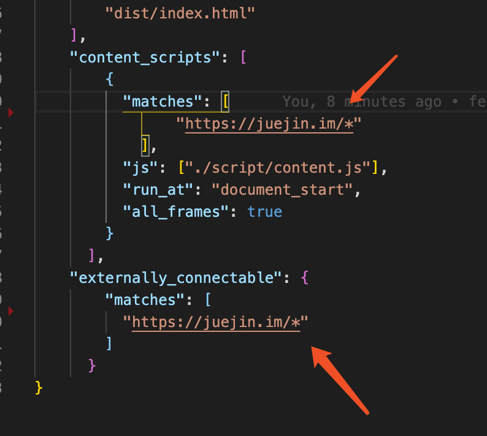
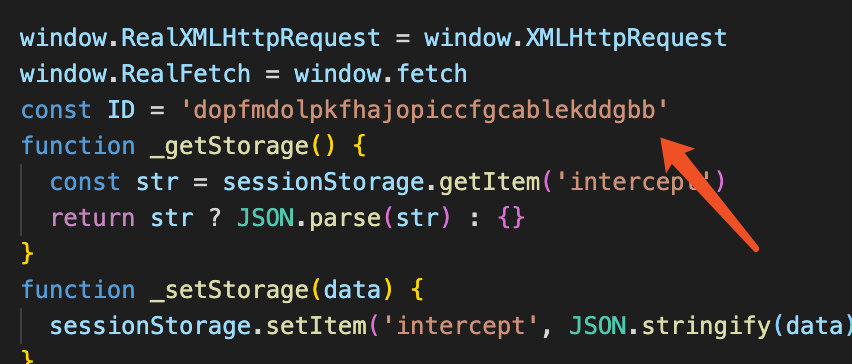
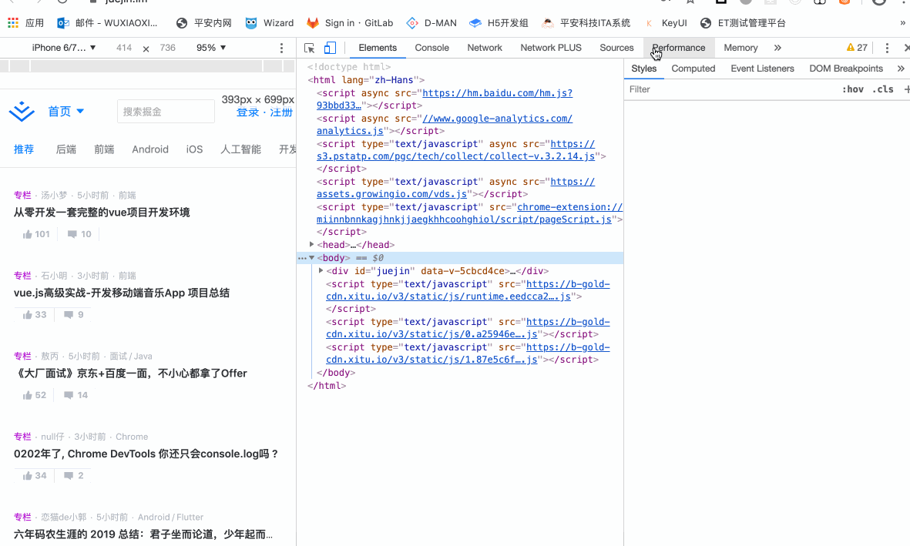

# network-plus

修改接口请求返回结果的Chrome插件，可用于调试/排查页面上的问题

## 使用方法
- 将需要调试的域名配置到`manifest.json`中，比如调试[掘金](https://juejin.im/)

- chrome打开 `chrome://extensions/` 页面，点击加载已解压的拓展程序。

- 然后将拓展程序的ID复制至script/pageScript.js里的`ID`

- 最后刷新拓展程序内的network-intercept插件即可。

- 演示

